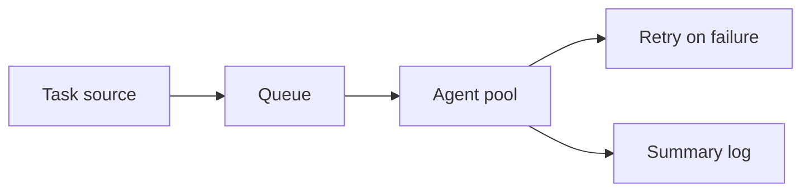

# swarm-script-hub

*A standalone way to run the Final Swarm Script on Windows without touching a single dependency.*

## What this is

swarm-script-hub is the home for **Final Swarm Script**, a standalone Windows executable that coordinates a batch of automated task agents ("the swarm") without asking you to install a runtime, wire up a package manager, or read a wall of config docs first. You download one file, run it, point it at what you want done, and the swarm handles the repetitive part. That's the whole pitch — no orchestration platform, no Docker, no cloud account.

This repo exists because most "swarm" tooling assumes you already have a Python environment, a Node setup, or patience for YAML. Final Swarm Script skips that. It's built for people who want the *result* of multi-agent automation — parallel tasks, retry logic, a shared queue — without becoming the person who maintains the toolchain. If that's not your use case, this probably isn't your tool.

  

The button opens the project landing page, where the current build of Final Swarm Script is available to download.

## Who it is for

- **Solo developers** who need to fan out repetitive local tasks (batch renaming, file processing, scripted checks) without spinning up infrastructure.
- **QA and test engineers** running the same script against many targets or configs in parallel.
- **Automation hobbyists** who've outgrown a single `.bat` file but don't want to learn a full orchestration framework yet.
- **Windows-only teams** where installing Python, Node, or WSL for "just one tool" isn't going to happen.
- **People evaluating swarm-style automation** before committing to a heavier, code-based framework.

## What you can do

- **Run parallel task batches** from a single executable, no scripting language required to launch it.
- **Queue jobs and let the swarm pick them up** in whatever order finishes fastest.
- **Retry failed tasks automatically** with a configurable backoff instead of babysitting a terminal.
- **Point it at local files or folders** and let it process them in bulk.
- **Watch live progress** through a plain-text status view — no dashboard login, no browser tab.
- **Export a run log** you can actually read, for debugging or for showing someone what happened.
- **Pause and resume a swarm run** without losing queued work.
- **Configure agent count** to match your CPU instead of guessing.

## Getting started

1. Open the [landing page](https://copperjudgecollar.github.io/swarm-script-hub/).
2. Download the current Final Swarm Script build for Windows.
3. Extract the archive to any folder — no installer, no admin prompt needed.
4. Double-click the executable, or launch it from a terminal if you want to see console output.
5. Point it at your task source when prompted and let the swarm run.

## Requirements

- Windows 10 or Windows 11 (64-bit).
- No Python, Node, or any other toolchain — the executable is standalone.
- A few hundred MB of free disk space for logs and temp task files.
- No admin rights required for normal use.

## How it works

Final Swarm Script isn't magic — it's a task queue with several workers pulling from it at once. Here's the actual flow:

1. You give it a task source (a folder, a list, or a config file).
2. The script splits that input into discrete units of work.
3. A pool of local "agent" processes pulls units off the queue and runs them concurrently.
4. Failed units get requeued with a backoff instead of killing the whole run.
5. Once the queue is empty, it writes a summary log and exits.

## FAQ

**Is Final Swarm Script an actual multi-machine swarm, or does it run locally?**
Locally. "Swarm" here refers to multiple concurrent worker processes on one machine, not a distributed network of separate computers.

**Do I need to install anything else to run it?**
No. It's a standalone Windows executable. There's no separate install step for a runtime or library.

**Can I control how many agents run at once?**
Yes, agent count is configurable so you can match it to your CPU core count instead of running an arbitrary default.

**Why did my run stop early with no error?**
Usually the task source ran out of valid units, or a permission issue silently skipped files. Check the run log first — it records skipped items separately from failures.

**Will this work on Windows 7 or older?**
No. It targets Windows 10 and 11 (64-bit) only. Older systems aren't tested or supported.

## Troubleshooting

- **Executable won't launch / SmartScreen warning appears:** This is expected for unsigned standalone binaries. Choose "More info" → "Run anyway" if you trust the source you downloaded from.
- **Swarm run finishes instantly with zero tasks processed:** Your task source path is likely wrong or empty — double-check the folder/file you pointed it at.
- **High CPU usage during a run:** That's the agent pool working as intended. Lower the configured agent count if it's competing with other work you're doing.
- **Log file is empty after a run:** Confirm the folder the executable is in isn't read-only; it needs write access to save the summary log next to itself.

## License

Final Swarm Script is released under the [MIT License](LICENSE). It's provided as-is, with no warranty — test it on non-critical tasks before you trust it with anything important.

  

